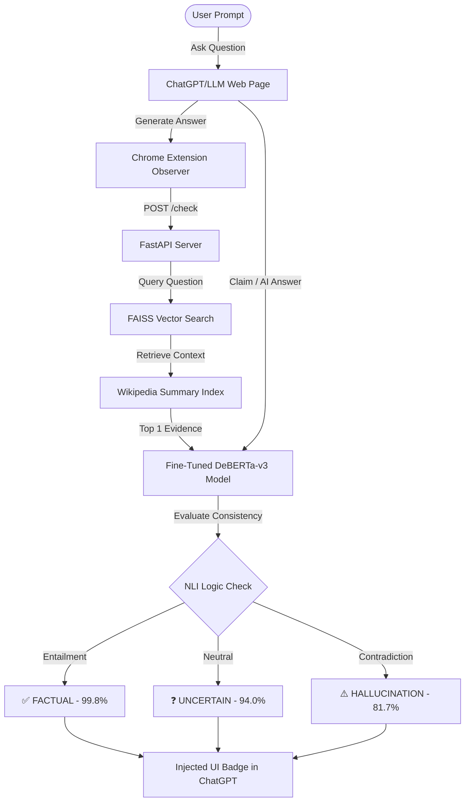

# 🔍 Real-Time LLM Hallucination Detector

<p align="center">
  
  
  
  
  
</p>

> *"ChatGPT said it. But is it actually true?"* 

A real-time hallucination detection system that sits inside your browser, automatically checks AI responses against retrieved evidence, and tells you whether to trust the answer — before you act on it.

---

## 🚨 The Problem
Every day, millions of people trust LLM answers that are completely wrong.
- **Legal Risks**: A US lawyer submitted fake court cases generated by ChatGPT — and got fined by a judge.
- **Academic Issues**: Students submit invented research citations that do not exist.
- **Business Decisions**: Professionals make critical calls based on fabricated statistics.

There is no warning. No flag. No way to know. **Until now.**

---

## ✅ What This System Does



---

## 🧠 Core Architecture & Features

* 🛡️ **Real-Time Fact Verification**: Automatically intercepts chat responses using DOM `MutationObservers` (Manifest V3) and validates them without manual copy-pasting.
* ⚡ **Semantic RAG Engine**: Utilizes **FAISS** and `all-MiniLM-L6-v2` SentenceTransformers to search and extract factual summaries from a 119-topic custom Wikipedia index.
* 🧠 **Fine-Tuned Classifier**: Leverages a fine-tuned **DeBERTa-v3-base** (184M parameters) model trained on the FEVER NLI dataset to evaluate logical alignment.
* ☁️ **Memory-Optimized Cloud Proxy**: Features a hybrid local/serverless execution mode to bypass 512MB cloud RAM limits, querying the Hugging Face Inference API dynamically.

---

## 📊 Model Performance

| Metric | Score |
| :--- | :--- |
| **Accuracy** | **87.05%** |
| **F1 Score (Weighted)** | **86.90%** |
| **F1 Score (Macro)** | **86.27%** |

---

## 🛠️ Tech Stack

| Component | Technology | Description |
| :--- | :--- | :--- |
| **NLP Classifier** | Microsoft DeBERTa-v3-base | Fine-tuned 184M parameter model for NLI task. |
| **Dataset** | FEVER NLI | 25,011 training examples. |
| **Vector Search** | FAISS + SentenceTransformers | Meta's flat L2 index running `all-MiniLM-L6-v2`. |
| **Backend** | FastAPI + Uvicorn | Lightweight asynchronous Python server. |
| **Frontend** | Chrome Extension (Manifest V3) | Native DOM integration for ChatGPT. |
| **Deployment** | Render + Hugging Face | Free-tier compatible hosting (<150MB RAM). |

---

## 📁 Project Structure

```text
llm-hallucination-detector/
├── backend/
│   ├── build_knowledge_base.py  # Crawls Wiki and builds FAISS index
│   ├── main.py                  # FastAPI server entry point
│   ├── model.py                 # Hybrid (Local/Serverless API) detector
│   ├── retriever.py             # FAISS search utility
│   ├── test_api.py              # HTTP endpoint tester
│   └── test_detector.py         # Pipeline inference tester
├── data/
│   ├── chunks.pkl               # Factual text fragments
│   └── knowledge_base.index     # Serialized FAISS index vectors
├── extension/
│   ├── manifest.json            # Manifest V3 extension configuration
│   ├── content.js               # Captures chat text & injects UI badges
│   ├── popup.html               # Extension settings interface
│   └── popup.js                 # Popup actions handler
└── notebooks/
    ├── 01_load_data.ipynb
    ├── 02_EDA.ipynb
    ├── 03_RAG_pipeline.ipynb
    ├── 04_preprocessing.ipynb
    └── 05_train_deberta.ipynb
```

---

## 🔌 API Documentation

### POST `/check`
Evaluates an AI answer against retrieved facts.

**Request Body:**
```json
{
  "question": "Who invented the telephone?",
  "ai_answer": "Alexander Graham Bell invented the telephone."
}
```

**Response Body (200 OK):**
```json
{
  "label": "FACTUAL",
  "confidence": 0.998,
  "summary": "Appears factual (99.8% confidence)",
  "evidence": [
    {
      "topic": "Alexander Graham Bell",
      "text": "Alexander Graham Bell (March 3, 1847 – August 2, 1922) was an inventor credited with inventing the telephone...",
      "url": "https://en.wikipedia.org/wiki/Alexander_Graham_Bell"
    }
  ]
}
```

---

## 🚀 How to Setup and Run

### 1. Local Environment Setup
Clone the repository and install the dependencies:
```bash
git clone https://github.com/Nivetha15122006/hallucination-detector.git
cd hallucination-detector

# Create and activate virtual environment
python -m venv venv
# On Windows:
.\venv\Scripts\activate
# On Linux/macOS:
source venv/bin/activate

# Install dependencies
pip install -r requirements.txt
```

### 2. Build the Knowledge Base (RAG Index)
Compile the Wikipedia RAG database index:
```bash
python backend/build_knowledge_base.py
```
*This downloads the Wikipedia extract summaries, compiles embeddings, and outputs `chunks.pkl` and `knowledge_base.index` in the `data/` directory.*

### 3. Run Pipeline Inference Tests (No Server Required)
Verify the model's accuracy directly from the command line:
```bash
python backend/test_detector.py
```

### 4. Run the FastAPI Server
Start the web API locally:
```bash
python backend/main.py
```
*The local server will start listening at `http://localhost:8000`.*

### 5. Install the Chrome Extension
1. Open Google Chrome and go to `chrome://extensions/`.
2. Enable **Developer mode** in the top-right corner.
3. Click **Load unpacked** in the top-left corner.
4. Select the **`extension/`** folder inside your project workspace.
5. Go to ChatGPT, ask a question (e.g. *"Who invented the telephone?"*), and watch the badges render instantly!

### 6. Cloud Deployment (Render)
To host the backend API on Render's free tier without memory crashes:
1. Create a **Web Service** on Render connected to this repository.
2. Choose **Python 3** as the runtime.
3. Set the **Build Command** to: `pip install -r requirements.txt`
4. Set the **Start Command** to: `uvicorn backend.main:app --host 0.0.0.0 --port $PORT`
5. In **Advanced Settings**, add this environment variable:
   - `USE_HF_API`: `true` *(Forces server to route model checks through Hugging Face's serverless pipeline, saving RAM)*.

---

**👩‍💻 Built By**

Nivetha G — M.Sc. AI & ML, Coimbatore Institute of Technology
- **GitHub**: [@Nivetha15122006](https://github.com/Nivetha15122006)
- **Model weights**: [NiviG/hallucination-detector](https://huggingface.co/NiviG/hallucination-detector)
